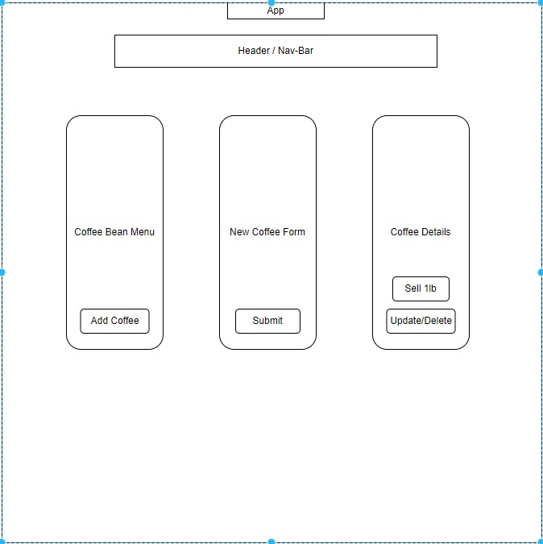

# Coffee Shop

#### Epicodus Week 16 Code Review

#### By Chris Loveless

## Technologies Used

* _React_
* _JavaScript_
* _JSX_
* _CSS_
* _HTML_
* _npm_

## Mock-Up


## Description
This app is created to demonstrate proficiency with building a React Application that manages local and shared state. The user is able to track the inventory of items and be notified when the item is out of stock.

## Setup/Installation Requirements

* Clone down the git repo to the ```desktop```
* Install all packages with ```$ npm install``` 
* Build the project using ```$ npm run build``` 
* Start a live development server with ```$ npm start```

## Available Scripts

In the project directory, you can run:

### `npm start`

Runs the app in the development mode.\
Open [http://localhost:3000](http://localhost:3000) to view it in your browser.

The page will reload when you make changes.\
You may also see any lint errors in the console.

### `npm test`

Launches the test runner in the interactive watch mode.\
See the section about [running tests](https://facebook.github.io/create-react-app/docs/running-tests) for more information.

### `npm run build`

Builds the app for production to the `build` folder.\
It correctly bundles React in production mode and optimizes the build for the best performance.

The build is minified and the filenames include the hashes.\
Your app is ready to be deployed!

See the section about [deployment](https://facebook.github.io/create-react-app/docs/deployment) for more information.

### `npm run eject`

**Note: this is a one-way operation. Once you `eject`, you can't go back!**

If you aren't satisfied with the build tool and configuration choices, you can `eject` at any time. This command will remove the single build dependency from your project.

## Known Bugs

* none found

## License
Copyright (c) 2022 Chris Loveless
_[MIT](https://choosealicense.com/licenses/mit/)_
